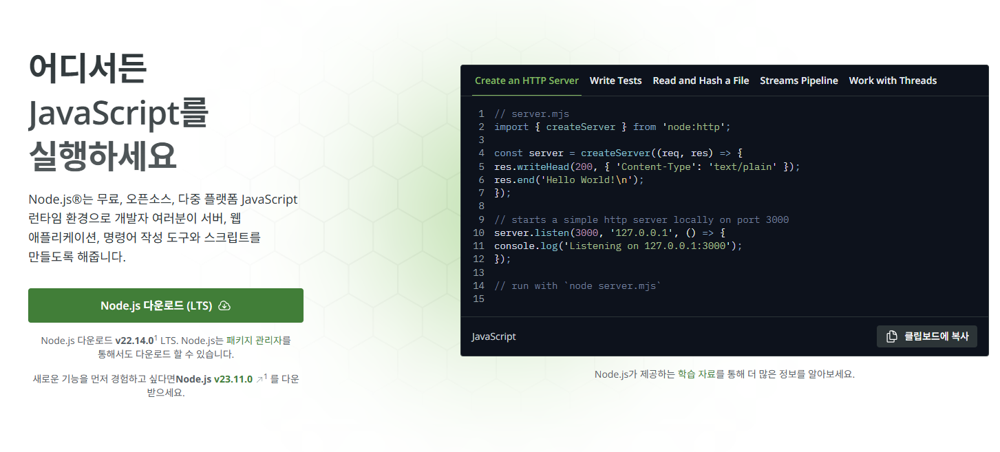
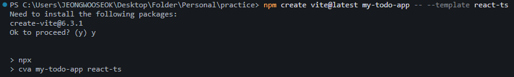
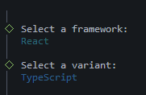
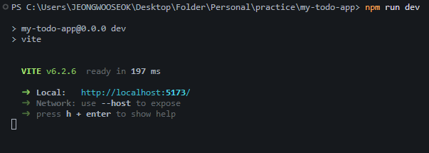
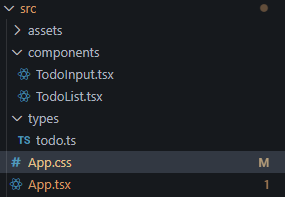
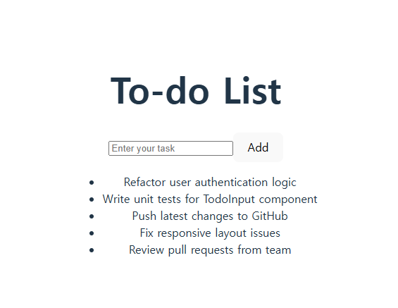
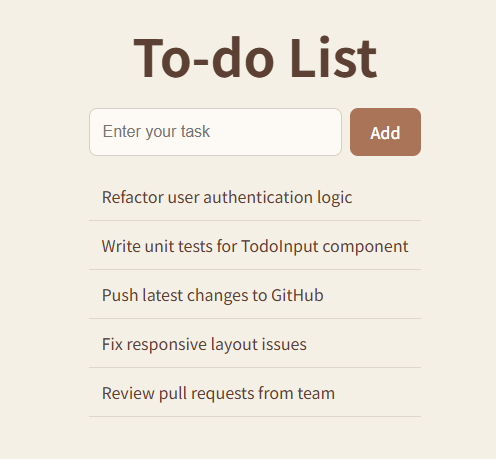

# 🇦🇺 Full-Stack To-do App: From Korea to Australia

This project is part of my developer journey from Korea to Australia 🇰🇷➡️🇦🇺  
I’m building a full-stack To-do application using **React (with TypeScript)** and **Spring Boot**  
as I prepare for a software engineering role in the Australian tech industry.

---

## 🎯 Project Goals

- Practice full-stack development using real-world tools
- Document every step of my learning process
- Share my journey publicly through Medium blog posts
- Strengthen my portfolio for overseas job applications

---

## 📚 Blog Series on Medium

This project is being documented step-by-step in a Medium series:  
📝 [View my full blog series](https://medium.com/@wjddntjr4655)

| Part                                                                                                                                        | Title                                               |
| ------------------------------------------------------------------------------------------------------------------------------------------- | --------------------------------------------------- |
| 📘 [Part 1](https://medium.com/@wjddntjr4655/from-korea-to-australia-my-journey-to-becoming-a-developer-part-1-1c05cf0490c7)                | Setting up React + TypeScript with Vite             |
| ✨ [Part 2](https://medium.com/@wjddntjr4655/from-korea-to-australia-part-2-building-a-todo-ui-with-react-and-typescript-12e7b0893bab)      | Building a Clean Todo UI with React and TypeScript  |
| 💾 [Part 3](https://medium.com/@wjddntjr4655/from-korea-to-australia-part-3-making-my-todos-persistent-and-debugging-react-18-ba4aa7df9c27) | Making My Todos Persistent (and Debugging React 18) |
| 🔜 Part 4                                                                                                                                   | Task completion, deletion, and Context API          |
| 🔜 Part 5                                                                                                                                   | Backend integration with Spring Boot                |

---

## ✨ Part 1: React + TypeScript Environment Setup

> In Part 1, I set up the development environment using React, TypeScript, and Vite.  
> I also documented Node.js installation and ESLint/Prettier setup.

### ✅ Screenshots

- **Node.js 설치 화면**  
  

- **Vite 프로젝트 생성 과정**  
    
  

- **개발 서버 실행 화면**  
  

---

## 🧩 Part 2: Building the Todo UI with React + TypeScript

> In Part 2, I built the actual UI with reusable components, type safety, and custom styling.

### 📦 Features

- Add todos with `TodoInput`
- Display todos with `TodoList`
- Type-safe structure using a `Todo` interface
- Clean brown + beige themed UI (CSS)
- Fully responsive and globally accessible

### 🎨 Screenshots

- **패키지 구조도**  
  

| Before                                    | After                                   |
| ----------------------------------------- | --------------------------------------- |
|  |  |

---

## 💾 Part 3: Making My Todos Persistent (and Debugging React 18)

> In Part 3, I implemented localStorage-based persistence so that todos survive page reloads.  
> While doing so, I encountered an unexpected issue caused by React 18's Strict Mode—  
> and solved it by refining my useEffect logic.

### 🔍 Highlights

- Save todos in the browser using `localStorage`
- Load data automatically when the app starts
- Prevent unwanted overwrites in React 18’s development mode
- Improved reliability and user experience

👉 [Read Part 3 on Medium](https://medium.com/@wjddntjr4655/from-korea-to-australia-part-3-making-my-todos-persistent-and-debugging-react-18-ba4aa7df9c27)

---

## 🧰 Tech Stack

### 🔹 Frontend

- React
- TypeScript
- Vite
- ESLint, Prettier

### 🔹 Backend (coming soon)

- Java 17
- Spring Boot
- MySQL

---

## 🚀 Getting Started (Frontend)

```bash
npm install
npm run dev
```

🙋 About Me
Name - Wooseok Jung (정우석)
Location - South Korea 🇰🇷
Goal - Become a full-stack developer in Australia 🇦🇺
Blog - [My Medium Blog](https://medium.com/@wjddntjr4655)  
GitHub - [@JeongWS-dev](https://github.com/JeongWS-dev)
Email - wjddntjr4655@naver.com
