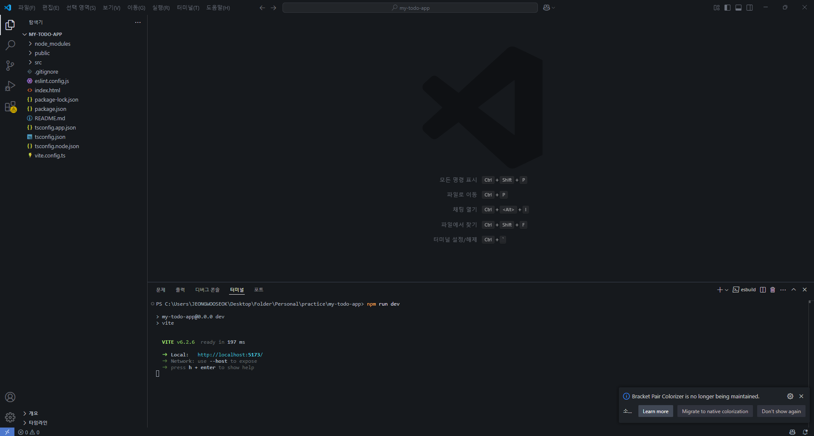

# 🇦🇺 Full-Stack To-do App: From Korea to Australia

This project is part of my developer journey from Korea to Australia 🇰🇷➡️🇦🇺  
I'm building a full-stack To-do application using **React (with TypeScript)** and **Spring Boot**  
as I prepare for a software engineering role in the Australian tech industry.

---

## ✨ Project Goals

- Practice full-stack development using real-world tools
- Document every step of my learning process
- Share my journey publicly through Medium blog posts
- Strengthen my portfolio for overseas job applications

---

## 📦 Tech Stack

### 🔹 Frontend

- React
- TypeScript
- Vite
- ESLint, Prettier

### 🔹 Backend (coming soon)

- Java 17
- Spring Boot
- MySQL

---

## 🛠 Getting Started (Frontend)

```bash
npm install
npm run dev
```

---

## 📸 Screenshots

### ✅ Node.js 설치 화면


### ✅ Vite 프로젝트 생성 과정

  


### ✅ 개발 서버 실행 화면


### ✅ 프로젝트 폴더 구조



---

## 📝 Blog Series on Medium

- 📘 [Part 1: Setting up React + TypeScript with Vite](https://medium.com/@wjddntjr4655/from-korea-to-australia-my-journey-to-becoming-a-developer-part-1-1c05cf0490c7)
  > More parts coming soon: UI Design, State Management, Backend Integration...

---

## 🙋 About Me

- **Name:** Wooseok Jung (정우석)
- **Location:** South Korea 🇰🇷
- **Goal:** Become a full-stack developer in Australia 🇦🇺
- **Blog:** [My Medium Blog](https://medium.com/@wjddntjr4655)
- **GitHub:** [github.com/JeongWS-dev](https://github.com/JeongWS-dev)
- **Email:** wjddntjr4655@naver.com
